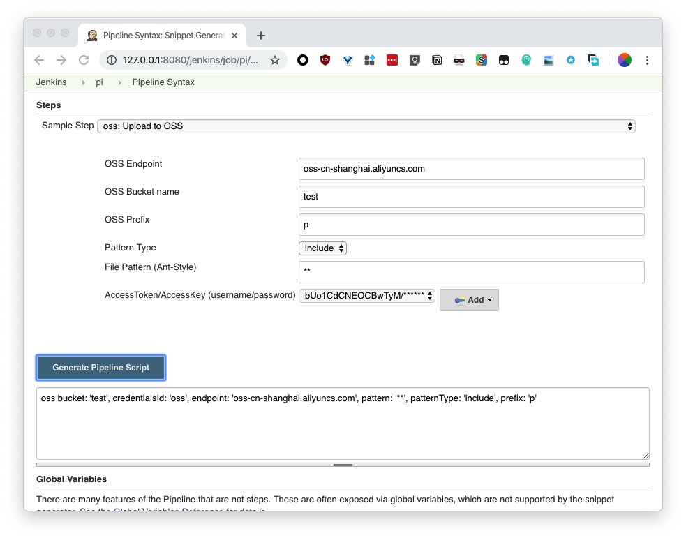
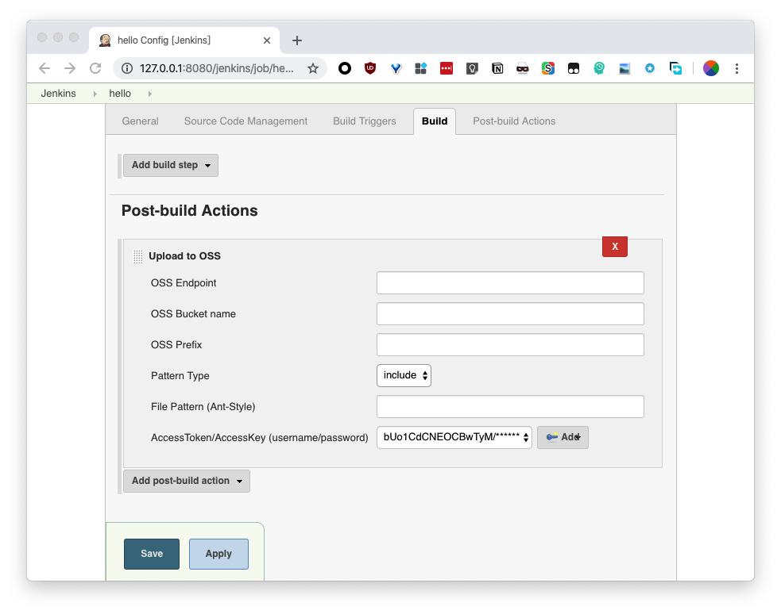

## OSS Uploader for Jenkins

### 开发

#### 打包

```
mvn compile hpi:hpi
```

#### 调试

```
mvn hpi:run
```


### 使用方法





### 注意事项
+ 会通过MD5判断文件是否重复（理论上超大文件会有影响，目测几十M的文件不会有影响
+ 路径匹配使用 [Ant-Style](https://stackoverflow.com/questions/2952196/learning-ant-path-style)
+ 使用Jenkins `Credentials`里的 `Username with password` 类型作为`accessToken`和`secretKey`
